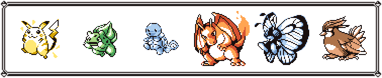

# pkmnhof



pkmnhof is a _Pokémon Hall of Fame_ image generator for Gen 1.

## Usage

```console
$ pkmnhof --help
Usage: pkmnhof [OPTIONS] NUMS...

  Display an image containing a Pokémon team.

  NUMS are 6 integers representing each Pokémon's National Pokédex number.

Options:
  -o, --output FILE         Save image to a file instead of displaying it.
  -r, --resize FLOAT RANGE  Resize original image (mainting its aspect ratio).
                            [1<=x<=3]
  --no-frame                Create image without a frame.
  --version                 Show the version and exit.
  -h, --help                Show this message and exit.
```

For example, running `pkmnhof --no-frame 18 65 112 103 130 6` will display the following image:


## Disclaimer

© 1995–2021 Nintendo/Creatures Inc./GAME FREAK inc. Pokémon
are trademarks of Nintendo.
