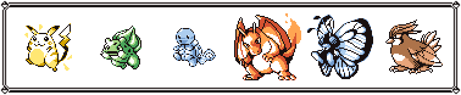
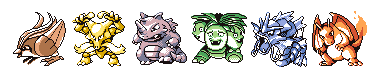

# pkmnhof



pkmnhof is a _Pokémon Hall of Fame_ image generator for Gen 1.

## Motivation

- generate custom Pokémon team images using official sprites
- learn about Python's modern packaging techniques
- obtain some experience building Python CLI applications

## Usage

```console
$ pkmnhof --help
Usage: pkmnhof [OPTIONS] NUMS...

  Display an image containing a Pokémon team.

  NUMS represent each Pokémon's National Pokédex number. Optionally use '_'
  for an empty slot.

Options:
  -o, --output FILE         Save image to a file instead of displaying it.
  -r, --resize FLOAT RANGE  Resize original image (mainting its aspect ratio).
                            [1<=x<=3]
  --no-frame                Create image without a frame.
  --version                 Show the version and exit.
  -h, --help                Show this message and exit.
```

### Examples

1. `pkmnhof --no-frame 18 65 112 103 130 6` will display the following image:

    

2. `pkmnhof --output team.png 87 91 80 124 131 _` will save the following image to `team.png`:

    

3. `pkmnhof --resize 2 25 1 7 6 12 17` was used to generate this README's banner.

## Development

- install and setup project with `pip install -e .[dev]` and `pre-commit install`

## Disclaimer

© 1995–2021 Nintendo/Creatures Inc./GAME FREAK inc. Pokémon
are trademarks of Nintendo.
